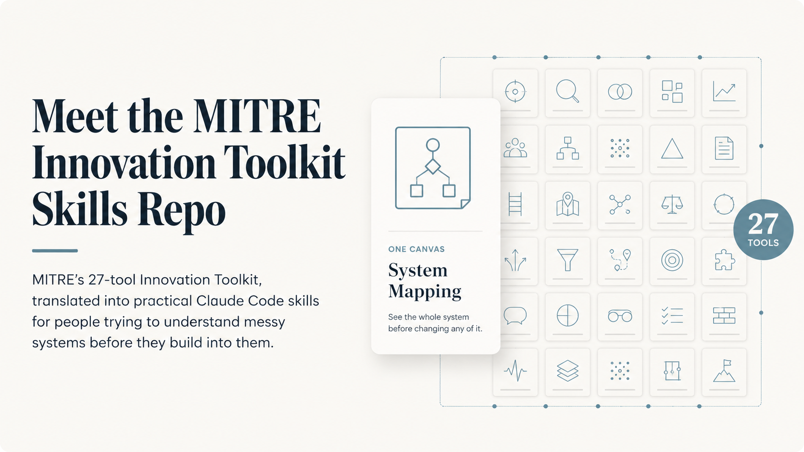
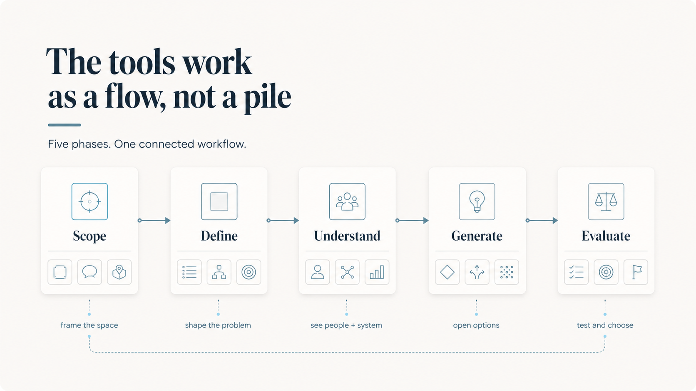
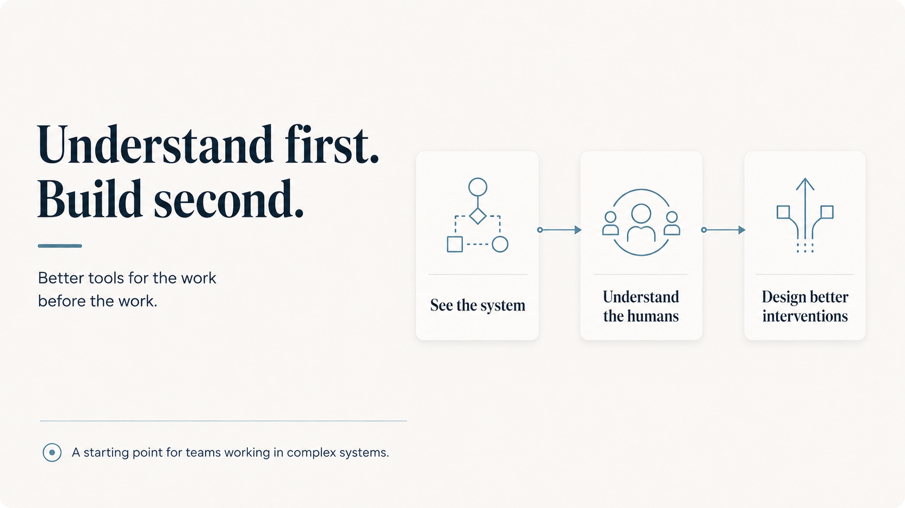

# Meet the MITRE ITK Skills Repo

## Behold, the MITRE’s 27-tool Innovation Toolkit, translated into practical Claude Code skills for people trying to understand messy systems before they build into them.

---

# I Taught One Canvas for Years. Turns Out MITRE Had 26 More.

*And why this library lives on its own, separate from everything else*

For years I taught the Problem Solving Canvas like it was the only tool that mattered. Turns out MITRE had 26 more waiting.

In workshops. In classrooms. In those "let's get aligned" sessions you schedule when the real meeting failed. I walked people through it like I was the sole keeper of a useful artifact. Like it was *the* thing.

It was a good tool. I believed in it.

Then, embarrassingly recently, I went looking for the source. And I found out it was one canvas in a toolkit of 27.

Twenty-seven.

MITRE (yes, that MITRE, the federally funded R&D center) had built an entire Innovation Toolkit. Structured facilitation tools, organized into five phases, grounded in human-computer interaction principles and design thinking. The whole double-diamond, from scoping a problem to evaluating solutions, packaged for teams doing hard things in complex systems.

I had been carrying one hammer and didn't know there was a toolbox.

---

## Wait, Don't You Already Have a Skills Library?

Yes. And if you've used [Product Manager Skills](https://github.com/deanpeters/Product-Manager-Skills), you know the format: structured SKILL.md files, organized by PM domain, designed to load into Claude and make it sharper at product work. That repo has gotten a lot of love. It covers a wide range of the PM craft: discovery, prioritization, communication, strategy, and more.

This is not that.

This library is narrower. Deeper. Different in character.

The MITRE ITK is fundamentally an **HCI-centric approach to systems and design thinking**, and that is a deliberate choice to keep it separate. Most PM skill libraries, including my own, don't go here. They focus on the functional craft of being a PM: writing good requirements, running good sprints, talking to users, building roadmaps. That work matters.

But there's a layer underneath all of that which most PM libraries skip:

*How do you think about systems? How do you understand the humans inside them? How do you design interventions that work with the grain of how people actually behave?*

That's what this toolkit teaches. And it's a complete, interconnected set of skills that felt wrong to break apart and absorb into a general-purpose library.

---

## The Flow Is the Point

Here's the thing about the MITRE ITK that you notice quickly once you start using it: **the tools hand off to each other.**

Stakeholder Identification Canvas feeds Stakeholder Map and Matrix. That feeds Quickstart Stakeholder Engagement. Problem Framing sets up Premortem. Painstorming leads to Personas leads to Journey Mapping leads to Value Proposition Canvas. The phases aren't just categories; they're a workflow. Scope, Define, Understand, Generate, Evaluate.

This is systems thinking baked into the structure of the library itself. The tools are designed to work as a sequence, as a flow, not as individual standalone techniques you grab off a shelf.

Folding these into a general PM skills library would have destroyed that. It would have turned a designed workflow into a collection of disconnected items. So they live here, together, in their own repo.

---

## A Small Confession About My Past Life

Back when I was still a software engineer, I started dabbling in UX/UI and design. That curiosity is a big part of what eventually pulled me toward product management. The questions that fascinated me weren't just "how do we build this?" They were "how do people actually experience this system? What are they really trying to do? What are we missing?"

That thread never left.

HCI (human-computer interaction) is the intellectual tradition that put those questions on rigorous scientific footing. It's the foundation that good UX practice was built on. And honestly, in the current era, where AI can generate interfaces in seconds and "ship fast" is the default posture, it's becoming a lost art.

I have a soft spot for it. I'm not ashamed.

And I think a lot of product managers today are operating without it. Not because they're bad at their jobs, but because systems thinking and HCI-rooted design practice were never part of how they were trained. They learned to write user stories. They didn't learn to map systems.

This library is a good starting point for that.

---

## Who This Is For

Product managers, product owners, product builders, business analysts: anyone who runs discovery, facilitates alignment, manages stakeholders, or ships products into complex systems.

Specifically: practitioners who sense that something is missing. That the sprint ceremonies and the prioritization frameworks are fine, but they don't help you see the system you're operating in. They don't help you understand who's actually affected and why. They don't give you language for the forces that make change hard.

This library gives you that language.

---

## What's in the Repo

[MITRE-ITK-Skills](https://github.com/deanpeters/MITRE-ITK-Skills) covers all 27 tools across five phases: SCOPE, DEFINE, UNDERSTAND, GENERATE, EVALUATE.

Every SKILL.md includes:

- **Best-fit scenarios**: specific PM situations where this tool earns its place on the agenda
- **Key Concepts**: the underlying theory and vocabulary, written for practitioners who know agile but may not know HCI
- **PM Applications**: mapped to real artifacts (PRDs, OKRs, roadmaps, sprint ceremonies, stakeholder briefings)
- **Common Pitfalls**: what product teams specifically get wrong, and what it costs them

The repo also includes 27 **Claude Code skills**, one per tool, prefixed `itk-`. Install them, invoke `/itk-premortem` or `/itk-journey-mapping`, and get a session that already knows the tool cold: when it fits, what vocabulary to use, what failure modes to watch for. Experienced practitioners can skip the guided flow and go straight to the work. That's by design.

**The pedagogic intent is baked in.** This isn't a cheat sheet. It's a learning library. The goal is that after you run a few of these tools, you start to think differently: about stakeholders, about systems, about the humans embedded in every problem you're trying to solve.

That, to me, is the real value.

---

## The Thing About Lost Arts

AI can do a lot of things now. It can write requirements. It can synthesize research. It can generate wireframes. It can produce roadmaps that look, superficially, like the product of serious thinking.

What it can't do is think about systems for you. It can't develop your intuition for how stakeholder dynamics actually play out. It can't give you the mental model of a user's world that comes from genuinely practicing this kind of inquiry over time.

Those capabilities live in the practitioner. They have to be built.

This library is a place to start building them.

Go look. Pick one tool. Run it in your next session.

[MITRE-ITK-Skills on GitHub](https://github.com/deanpeters/MITRE-ITK-Skills)
